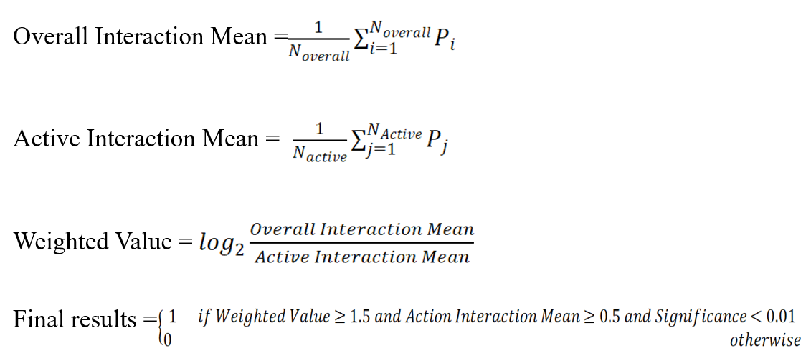

# Network Pharmacology Tools Based on PEPNN

The network pharmacology tools used for predicting peptide-target interactions are based on PEPNN. This script utilizes the PEPNN protein-peptide interaction model as a foundation and constructs a network pharmacology tool using drug target data from the scPDB database. This tool can predict interactions with 5,715 PDB data and 898 protein targets.

You need to install PEPNN according to the guidelines provided at [PepNN Installation](https://gitlab.com/oabdin/pepnn). After installation, proceed with predicting protein-peptide interactions.

Once the PEPNN data runs smoothly, copy all files to the main PepNN folder.

## Modes of ppnet.py

- `python ppnet.py` is for prediction mode.
  - `-pf`, `-prot_folder`: Input folder for the protein target library, with two options: `target` contains all 5,715 PDB data, and `target_mini` contains the 898 PDB data with the lowest resolution. The default is `target_min/`.
  - `-pp`, `-pep_folder`: Folder containing FASTA files of peptide sequences. The default is `example/peptides/`.
  - `-o`, `--output_directory`: Folder for PepNN prediction results, defaulting to `example/out`.
  
**Note**: The first time you run the prediction mode, a file named `prot_dict.pkl` will be generated in the folder set by `-o`. This may take some time. When you run it a second time, it will directly read the `prot_dict.pkl` file from the `-o` directory. If you change the input protein target library (e.g., from `target_min/` to `target`), you need to delete the `prot_dict.pkl` file in the `-o` directory.

- `python ppnet.py -a` is for analysis mode.
  - `-r`, `--results_folder`: The folder for result data, the same as the `-o` folder from the previous step. The default is `example/out`.
  - `-t`, `--target_folder`: The protein target library folder from the previous step. The default is `target_min/`.
  - `-u`, `--uniprot_mapping_file`: The mapping file between UniProt ID and PDB ID. The default is `UniProt_PDB_lib.xlsx`.
  - `-of`, `--output_file`: The output statistical results file. The default is `analysis_output.csv`.
  - `-s`, `--significance_threshold`: The default is 0.001.
  - `-w`, `--weighted_value_threshold`: The default is 1.5.
  - `-i`, `--interaction_value_threshold`: The default is 0.5.

## Key Formulas

